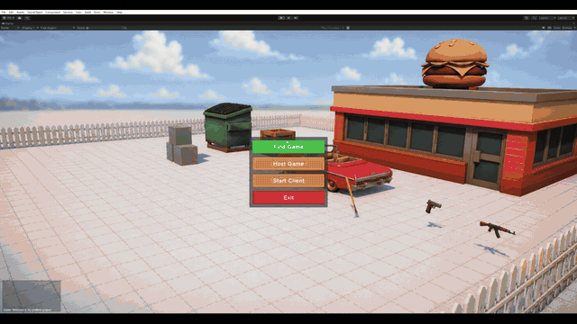
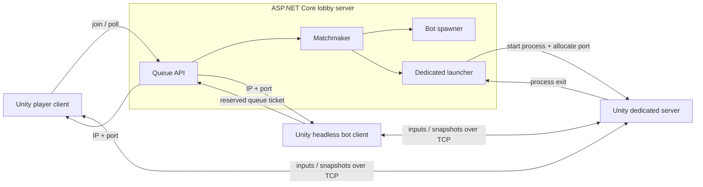
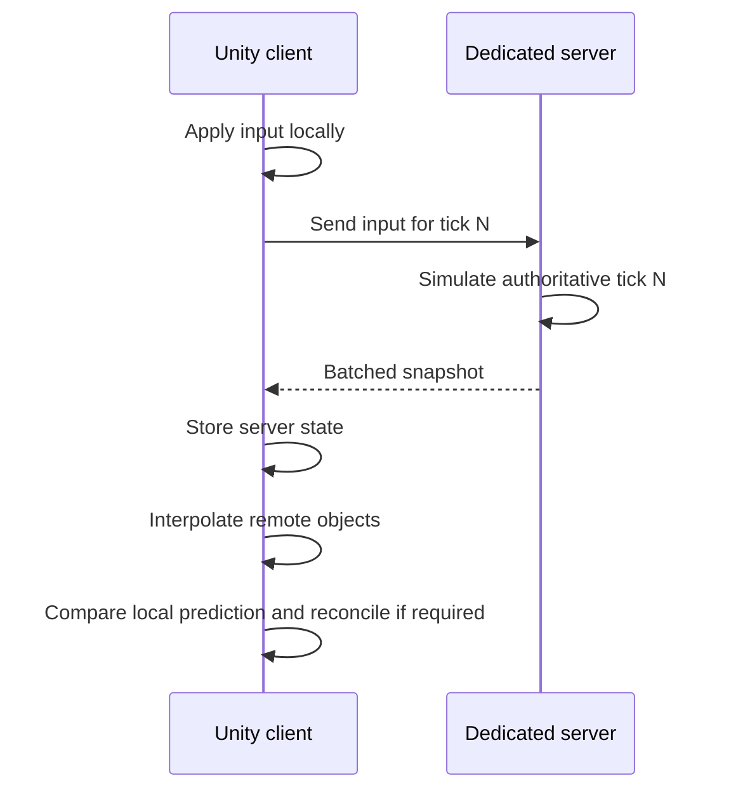

<div align="center">

# Custom Multiplayer Sandbox

**A server-authoritative multiplayer sandbox built in Unity to explore custom netcode, client-side prediction, physics synchronization, matchmaking, and dedicated server orchestration.**


</div>

## Gameplay

### Third-person combat

<p align="center">
  
</p>

### Vehicle physics

<p align="center">
  
</p>

## Overview

This is an engineering-focused project built to explore the systems behind a real-time networked game instead of relying on a ready-made networking framework.

The project includes a playable Unity client, a headless dedicated server, full Unity bot clients, and an ASP.NET Core service that creates matches and manages game server processes. The complete stack has been deployed and tested on remote infrastructure with real network latency.

> [!NOTE]
> This is a learning and portfolio project focused on multiplayer architecture, synchronization, and deployment. It is not intended to replace a production networking SDK.

## Highlights

| Area | Implemented systems |
|---|---|
| Gameplay | Third-person movement, animation, hitscan weapons, reloading, damage, death, pickups, and a drivable vehicle |
| Networking | Authoritative server, input commands, client-side prediction, reconciliation, interpolation, extrapolation, and artificial latency testing |
| Synchronization | Configurable simulation and snapshot timing, physics state history, adaptive interpolation delay, batched object states, and GZip compression |
| Matchmaking | Queue tickets, automatic match creation, connection information, and bot reservations |
| Operations | Headless client and server builds, dynamic port allocation, process lifecycle management, service hosting, and remote logging |

## System architecture



### Match lifecycle

1. A player requests a queue ticket from the lobby API.
2. The matchmaker calculates how many players are missing from the next match.
3. Missing slots are filled with reserved bot clients only when necessary.
4. The lobby allocates a free port and starts a Unity dedicated server process.
5. Matched clients receive the server address and connect directly to it.
6. The dedicated server runs the authoritative simulation.
7. When the match ends, the Unity process exits and its port becomes available again.

## Networking model

The server is authoritative over movement, physics, combat, health, and match state. Clients send timestamped inputs and immediately simulate their own input locally to hide round-trip latency.



### Simulation and snapshot timing

- The simulation rate follows Unity's configured fixed timestep rather than assuming a hard-coded tick rate.
- Snapshot cadence is configured independently as a number of processed simulation ticks.
- Local and authoritative states are stored in tick-indexed circular history buffers for prediction and reconciliation.
- Adaptive interpolation: estimates snapshot age and jitter, grows the buffer quickly during instability, and shrinks it gradually when the connection improves.
- Extrapolation: advances position using linear velocity and rotation using angular velocity.

### Snapshot transport

- States for all synchronized objects are grouped into one `SyncPredictablesCmd`.
- Small commands remain plain JSON for low overhead.
- Messages larger than 256 bytes are GZip-compressed when compression produces a smaller payload.
- TCP is currently used as the transport to keep the implementation understandable while experimenting with prediction and synchronization.

## Engineering work demonstrated

Development included diagnosing and fixing real multiplayer and deployment problems:

- preventing an extra bot from joining a full match;
- cancelling bot reservations when human players fill the queue;
- releasing ports after dedicated processes exit;
- avoiding multiple snapshots after a server catch-up step;
- reconstructing states for ticks skipped by the snapshot interval;
- batching and compressing object snapshots;
- stabilizing remote physics with interpolation and extrapolation;
- cleaning up destroyed DOTween sequences and process resources;
- deploying the complete stack to a remote host and running full matches over a real network.

## Validation approach

Validation focuses on complete multiplayer sessions rather than isolated demo scenes. The deployed stack has been exercised with the lobby service, dynamically launched dedicated servers, a real player client, and multiple full Unity bot clients running concurrently.

The main end-to-end scenarios include:

- joining matchmaking and filling only the missing slots with reserved bots;
- receiving connection details and completing a remote match;
- shutting down the dedicated process and returning its port to the available pool;
- running consecutive matches without retaining stale processes, objects, or reservations;
- comparing prediction, reconciliation, interpolation, and extrapolation under real and artificially increased latency;
- monitoring network traffic, CPU usage, memory consumption, process cleanup, and runtime logs during full sessions.

Testing is currently integration-oriented and primarily manual. Automated coverage for networking, matchmaking, and process lifecycle behavior remains part of the roadmap.

## Repository layout

```text
Assets/
├── BuildsTool/Editor/          Unity client and server build automation
└── Scripts/
    ├── Multiplayer/            Reusable custom networking submodule
    ├── Player/                 Movement, prediction, animation, and player states
    ├── Weapon/                 Weapon models and combat logic
    ├── Car/                    Vehicle physics and seating
    ├── Commands/               Gameplay network commands
    └── GameStates/             Match lifecycle
```

Related repositories:

- [Multiplayer](https://github.com/reNER0/Multiplayer) — reusable networking code included as a Git submodule.
- [MultiplayerLobbyServer](https://github.com/reNER0/MultiplayerLobbyServer) — ASP.NET matchmaking, bots, and dedicated process orchestration.

## Getting started

### Requirements

- Git with submodule support
- Unity **2022.3.62f2 LTS**
- Unity platform modules for the client and server targets you intend to build
- .NET 8 SDK for the lobby server

### Clone

```bash
git clone --recursive https://github.com/reNER0/PortfolioGame.git
cd PortfolioGame
```

If the repository was cloned without submodules:

```bash
git submodule update --init --recursive
```

### Build the Unity applications

Open the project in Unity and use the custom `Build` menu:

- `Build/Windows_Client`
- `Build/Windows_Server`
- `Build/Linux_Client`
- `Build/Linux_Server`

Output is written under `Builds/Client` and `Builds/Server`.

The same build methods can be called in batch mode. For example:

```powershell
Unity.exe -batchmode -quit `
  -projectPath "C:\path\to\PortfolioGame" `
  -executeMethod BuildTool.BuildServerLinuxHeadlessDev
```

### Configure and run the lobby server

Clone the [MultiplayerLobbyServer](https://github.com/reNER0/MultiplayerLobbyServer) repository and configure its `appsettings.json`:

```json
{
  "DedicatedServer": {
    "ExecutablePath": "/opt/multiplayer-lobby/server/ServerBuild.x86_64",
    "PortMin": 7001,
    "PortMax": 7010,
    "BindIp": "YOUR_PUBLIC_IP"
  },
  "BotSpawner": {
    "Enabled": true,
    "IntervalSeconds": 1,
    "MaxBots": 10,
    "BotLifetimeSeconds": 150,
    "ClientPath": "/opt/multiplayer-lobby/bot/ClientBuild.x86_64",
    "BaseArgs": "-bot -batchmode -nographics"
  }
}
```

`BindIp` must be the address clients can use to reach the dedicated server. For a public host, use its public IP or DNS name.

Start the API:

```bash
dotnet run --project MultiplayerLobbyServer/MultiplayerLobbyServer.csproj \
  -- --urls http://0.0.0.0:7000
```

Configure the matchmaking base URL in the Unity `MatchmakingClient`, start the game, and enter the matchmaking queue from the main menu.

For remote hosting, allow the API port and the configured dedicated-server port range through the firewall.

## Testing network conditions

The in-game network settings panel can add artificial latency and jitter. This is useful for comparing correction modes and validating interpolation under unstable delivery.

## Known limitations

- The current transport is TCP, so packet loss can cause head-of-line blocking.
- The protocol uses JSON and runtime type metadata; a binary protocol is a future optimization.
- Authentication and command authorization still require hardening before hosting the server for untrusted public clients.
- Matchmaking state is stored in memory and is not persisted across restarts.
- Reconnect and migration of an active match are not implemented.
- The current deployment model runs the lobby and game processes on one host.
- Testing has focused on small four-player matches rather than large-scale concurrency.

## Roadmap

- Server-assigned client identity and a strict client-command allowlist
- Dedicated-server readiness handshake before returning connection details
- Automated tests for interpolation, matchmaking, bots, and port reuse
- CI builds for the ASP.NET service and Unity project
- Binary and delta-compressed snapshots
- Reconnect support and persistent match history
- Reproducible deployment scripts and containerized lobby hosting

## Credits

- Networking, gameplay systems, matchmaking, deployment, and tooling: **reNER0**
- All 3D models: generated with **Hunyuan3D**
- Sound effects and music: generated with **Stable Audio 3**
- Tweening: [DOTween](https://dotween.demigiant.com/)

## License

Source code licensing and third-party asset attribution will be documented before the final public release. All external assets remain subject to their original licenses.
